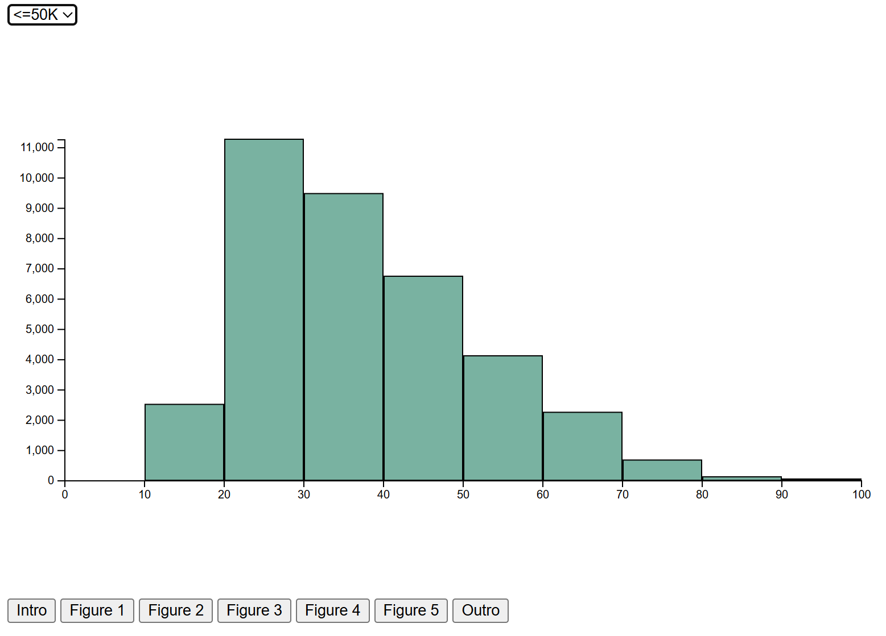
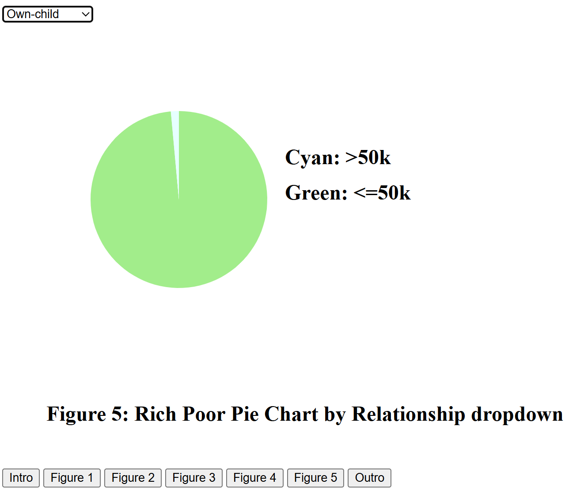

# DataViz

Adult Income Dataset was created by Barry Becker from the 1994 Census database.
 
It is widely used for predicting whether annual income exceeds $50K/yr based on census data.
 
The original dataset can be found in UCI Machine Learning Repository
 
https://archive.ics.uci.edu/dataset/2/adult
 
The interactive data visualization can be viewed on https://pjlau.github.io/data_viz.html
 
If the website is not working, it means the workflow in this repository expires.
## Visualization

 

